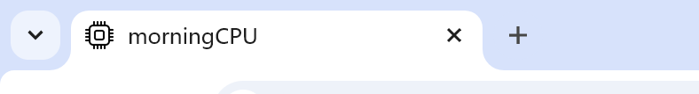

+++
author = "morning"
title = "使用github+hugo创建个人博客"
description = "用hugo创建静态博客页面，并通过github进行自动部署"
date = "2026-01-28"
image = "title.webp"
readingtime=true
math= false

categories = [
    "github",
    "hugo"
]
tags = []
slug= "001"
+++

本文介绍如何使用hugo和github构建个人博客   
参照B站 [@Letere-莱特雷](https://www.bilibili.com/video/BV1bovfeaEtQ/) 的教学：  
https://www.bilibili.com/video/BV1bovfeaEtQ/   
[Letere-莱特雷博客](https://letere-gzj.github.io/hugo-stack)   
https://letere-gzj.github.io/hugo-stack   
感谢大佬(*´∀`)~♥
<!-- more -->

---

## 1 资源准备
### 1.1 下载hugo
下载地址 https://gohugo.io/
点击上方github进入仓库    
点击tag选择需要的版本进行下载，注意要点进去，里面有不同的类型  


这里下载版本是 extended-0.131.0   
最好用同样的版本，不然依照这个教程会有些问题(有些函数，变量之类的可能变了)   
### 1.2 下载主题
hugo页面上方点击Themes
这里选择stack-3.26.0

---

## 2 准备工作
### 2.1 创建项目
cmd使用命令 `hugo new site name`(注意在hugo所在文件夹使用cmd)   
ex. `hugo new site blog`   
### 2.2 设置主题
将上面下载好的主题解压到 hugo/blog/themes
### 2.3 使用样例
**1.** 在解压的主题文件中可以发现exampleSite，这是示例文件   
将其中的content和hugo.yaml复制到项目主文件夹(也就是hugo/blog)   
**2.** 删除多余的hugo.toml   
**3.** 将主题文件夹多余的版本号去除(因为要和配置文件中匹配)  
**4.** 把blog/content/post/rich-content删除(里面有一些链接可能无法访问会导致不能正常启动) 
```yaml
# hugo.yaml
theme: hugo-theme-stack
```


### 2.4 启动
**1.** 将hugo目录中的hugo.exe复制到blog中(因为没有配置环境变量又要使用hugo)   
也没有必要配置环境变量，直接使用也方便
**2.** 进入新建的项目 `cd blog`   
**3.** 使用命令 `hugo server -D` 启动
**4.** 进入提示的网址


按住ctrl点击就可以浏览器打开


差不多这样(有些有改了没有复原，不要在意~)

---

## 3. 修改配置
### 3.1 完整的hugo.yaml配置文件
[hugo.yaml](hugo.txt)
### 3.2 详细说明
**1.** baseurl 下面配置github自动部署有用   
**2.** languageCode 网站的语言，告诉浏览器自己用的是什么语言   
**3.** theme 使用的主题   
**4.** paginate 分页，每一页有几个   
**5.** title 名字   
浏览器标签这里   



**6.** copyright 版权声明   
下面这里   


**7.** DefaultContentLanguage 创建的默认语言   
hugo文件格式为index.language.md   
如果你写为index.md那么默认就是index.DefaultContentLanguage.md   
**8.** hasCJKLanguage 如果使用中文就改为true   
**9.** languages 配置不同语言显示的主页


```yaml
zh-cn:
    languageName: 简体中文 #左下角语言选项的名字
    title: morningCPU # 名字
    weight: 2 # 权重，选项里排第几个
```
**params** 其他设置
```yaml
favicon: # 网页标签图标,放在 blog/static/
footer: # 角标
    since: 2026 #开始时间
```
下面那里


```yaml
sidebar: # 侧边栏设置
    emoji: 🤠 #头像旁的表情包
    subtitle: 一起记录知识！ # 名字下面的描述
    avatar: # 头像
        enabled: true
        local: true
        src: img/avatar.png # 放在 blog/assets/img/avatar.png
    compact: true # 紧凑模式,改为true更好看我觉得
```
+ 注意图片一定要是150*150的

```yaml
article: # 文章默认设置
    headingAnchor: false #标题左边的链接标签
    math: true
    toc: true # 目录
    readingTime: false
    license:
        enabled: false
        default: Licensed under CC BY-NC-SA 4.0
```

+ 这是默认设置，文章里面也可以设置并且优先级更高

```yaml
widgets: # 组件
    homepage:
        - type: search
        - type: archives
          params:
              limit: 5
        - type: categories
          params:
              limit: 5
    page:
        - type: toc
```
+ 左侧的选项，文章的目录
```yaml 
menu:
    main: []

    social:
        - identifier: github
          name: GitHub
          url: https://github.com/CaiJimmy/hugo-theme-stack
          params:
              icon: brand-github

        - identifier: zhihu
          name: zhihu
          url: https://www.zhihu.com/people/13-69-67-66/posts
          params:
              icon: zhihu
```
+ 侧边栏的小图标
+ 图标文件存在 blog/assets/icons
+ 可以在 [Tabler Icons](https://tabler.io/icons) 下载图标

---

## 4. 使用博客
**1.** 命令`hugo new content post/name/index.language.md`创建一个文件   
ex. `hugo new content post/test/index.md` (因为设置了默认所以就不写language了)   
(name是文件名，language是语言，md是文件格式)


**2.** 可以使用code或者其他打开目录   
这里就 `code E:\\library\\hugo\\blog\\content\\post\\test`

**3.** 创建模版
打开index.md会发现已经有内容了，这是因为有模版   
模版是 blog/archetypes/default.md   
可以使用下面这个模版
```markdown
+++
author = "morning"
title = '{{ replace .File.ContentBaseName "-" " " | title }}'
description = ""
date = {{ .Date }}
image = "title.jpg"

readingtime=true
math= false

categories = []
tags = []

slug= ""

series = []
aliases = []

draft = true
+++
```

---

## 5. github自动部署
### 5.1 github创建仓库   
比如仓库名为blog   
### 5.2 设置访问token   
头像->settings->Developer settings->personal access tokens->tokens(basic)   
### 5.3 设置仓库变量   
+ 用于安全访问token   
仓库->settings->secrets and variables->actions->repository secrets   
### 5.4 本地创建仓库
+ 在blog下创建仓库
+ 关联远程仓库
### 5.5 创建工作流配置文件
+ 创建blog/.github/workflows/blog.yaml
```yaml
name: deploy

# 代码提交到main分支时触发github action
on:
  push:
    branches:
      - main

jobs:
  deploy:
    runs-on: ubuntu-latest
    steps:
        - name: Checkout
          uses: actions/checkout@v4
          with:
              fetch-depth: 0

        - name: Setup Hugo
          uses: peaceiris/actions-hugo@v3
          with:
              hugo-version: "0.131.0"
              extended: true

        - name: Build Web
          run: hugo -D

        - name: Deploy Web
          uses: peaceiris/actions-gh-pages@v4
          with:
              PERSONAL_TOKEN: ${{ secrets.token }}
              EXTERNAL_REPOSITORY: morningCPU/blog
              PUBLISH_BRANCH: main
              PUBLISH_DIR: ./public
              commit_message: auto deploy
```
+ hugo-version，PERSONAL_TOKEN，EXTERNAL_REPOSITORY改一下
### 5.6 创建.gitignore文件
```txt
./public
./resources
./.hugo_build.lock
./hugo.exe
```
### 5.7 github设置action
仓库->settings->pages->branch->选择分支->save   
### 5.8 提交
需要`git push -f`强制提交，因为action会改变提交内容   
千万不要git pull，里面的内容是不一样的

---

## 6. 目录的修改
+ 要注意要二级标题目录才生效   
改为无序列表   
blog\assets\scss\custom.scss中写入   
```scss
/* --- Hugo Stack TOC 无序列表自定义 --- */

/* 1. 禁用原有的计数器数字 */
.widget--toc #TableOfContents ol li a:first-of-type::before {
    content: none !important;
}

/* 2. 还原列表的显示模式，并设置一级为实心圆 */
.widget--toc #TableOfContents ol,
.widget--toc #TableOfContents ul {
    list-style-type: disc !important;
    /* 一级圆点 */
    padding-left: 1.2rem !important;
    /* 留出圆点空间 */
    counter-reset: none !important;
}

/* 3. 强制每一行作为列表项显示（否则不显示圆点） */
.widget--toc #TableOfContents li {
    display: list-item !important;
    margin: 10px 0 10px 10px !important;
    /* 调整间距 */
}

/* 4. 设置二级及以上层级为空心圆 */
.widget--toc #TableOfContents li>ol,
.widget--toc #TableOfContents li>ul {
    list-style-type: circle !important;
    /* 二级圆点 */
    padding-left: 1.5rem !important;
    /* 层级缩进 */
    margin-top: 5px !important;
}

/* 5. 针对 Stack 主题高亮条的微调（防止遮挡圆点） */
.widget--toc #TableOfContents li.active-class>a {
    padding-left: 5px !important;
    margin-left: 0 !important;
}
```

---

## 7. 评论
### 7.1 utterances
**1.** github安装utterances
地址：https://github.com/apps/utterances
**2.** 修改配置文件
hugo.yaml->comments->provider   
打开并使用utterances   
utterances设置仓库   
### 7.2 giscus
**1.** github安装giscus
https://github.com/apps/giscus
**2.** 配置
https://giscus.app/zh-CN
**3.** 修改配置文件
hugo.yaml->comments->provider   
打开并使用giscus   
配置giscus     
**4.** 注意事项
1. 确保仓库是公开的
2. 仓库开启discussions(仓库->settings->general->features)
3. 配置映射关系pathname,discussion分类，其他默认就好